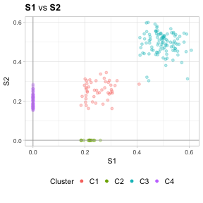
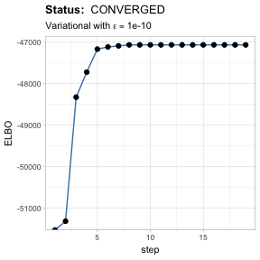
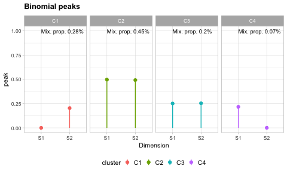
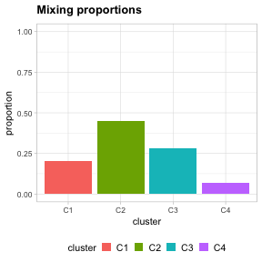
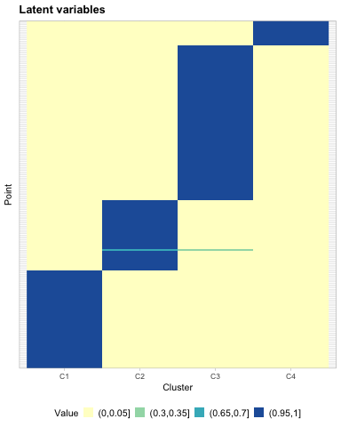

VIBER Vignette
================
Giulio Caravagna
14 February 2019

Install the package from github, use `devtools` to install directly from
GitHub and install required packages as well. You might need to install
explicitly these R packages

  - Pretty I/O: [pio](https://github.com/caravagn/pio)
  - Easy parallel [easypar](https://github.com/caravagn/easypar)

until we develop an automatic installer for
[VIBER](https://github.com/caravagn/VIBER). Once installed just load the
package

``` r
library(VIBER)
library(tidyverse)
```

To run the fit you need 2 tibbles (or matrices), with equal dimensions
and matched column names. One tibble contains the *counts of the
successful Bernoulli trials*, the other contains the *count of all the
attempted trials*.

In the package we provide `mvbmm_example`, a dataset which shows the
input format.

``` r
data("mvbmm_example")
```

The format is (`S1` and `S2` are the *dimensions*)

``` r
mvbmm_example$successes
```

    ## # A tibble: 231 x 2
    ##       S1    S2
    ##    <dbl> <dbl>
    ##  1    44    39
    ##  2    38    57
    ##  3    45    54
    ##  4    56    56
    ##  5    54    56
    ##  6    60    44
    ##  7    53    46
    ##  8    53    55
    ##  9    56    53
    ## 10    53    60
    ## # ... with 221 more rows

## Fitting the model

You can fit the model with the `variational_fit` function, which is
quite well documented

``` r
??variational_fit
```

You have control over several parameters. Concerning the mixture type
you can set the following

  - `K`, the maximum number of clusters returned
  - `alpha_0`, the concentration parameter of the Dirichlet mixture.
  - `a_0` and `b_0`, the prior Beta hyperparameter for each Binomial
    component

Concerning the variational optimization you can set the following

  - `max_iter`, the maximum number of fit iterations
  - `epsilon_conv`, the epsilon to measure convergence as ELBO absolute
    difference
  - `samples`, the number of fits computed.

The fitting engine makes use of the
[easypar](https://github.com/caravagn/easypar) package to run in
parallel the required number of fits. The default is multi-core
implementation that uses 80% of the available cores; you can disable
parallel runs and execute sequential turning off `easypar`, as explained
in its [Wiki](https://github.com/caravagn/easypar).

We run the fit with default parameters, the output model is print to
screen.

``` r
fit = variational_fit(
  mvbmm_example$successes,
  mvbmm_example$trials
)
```

    ##  [ VIBER - variational fit ] 
    ## 
    ##  INPUT 
    ##   Points N = 231  
    ## Clusters K = 10 (max)
    ##  
    ## Dirichlet alpha = 1e-06 (conc.) 
    ##      Beta a0 = 1; b0 =1 (shape)
    ##  
    ##      Beta (posterior) prior  
    ##  Optimize epsilon = 1e-10; steps =5000; r = 10 
    ## 
    ##  Registering to use multicores ...  2 / 4 [ratio 0.8]  OK

    ## Loading required package: doParallel

    ## Warning: package 'doParallel' was built under R version 3.4.4

    ## Loading required package: foreach

    ## Warning: package 'foreach' was built under R version 3.4.3

    ## 
    ## Attaching package: 'foreach'

    ## The following objects are masked from 'package:purrr':
    ## 
    ##     accumulate, when

    ## Loading required package: iterators

    ## Loading required package: parallel

    ##  Stopping parallel clusters ...    OK 
    ## 
    ## 
    ## BEST FIT
    ## 
    ##  [ mvbmm - Variational fit for Binomial mixtures ] 
    ##  
    ##     Points N = 231  
    ## Dimensions W = 2  
    ##        Fit CONVERGED (20 steps; eps. 1e-10) with Variational  
    ## 
    ## Binomial parameters (2 digits rounded) 
    ##  # A tibble: 2 x 10
    ##      C7    C3    C5    C9    C1    C2    C4    C6    C8   C10
    ##   <dbl> <dbl> <dbl> <dbl> <dbl> <dbl> <dbl> <dbl> <dbl> <dbl>
    ## 1  0.5    0    0.25  0.22   0.5   0.5   0.5   0.5   0.5   0.5
    ## 2  0.49   0.2  0.25  0      0.5   0.5   0.5   0.5   0.5   0.5
    ##  
    ## Proportions (ordered)  
    ## # A tibble: 10 x 2
    ##    entry         value
    ##  * <chr>         <dbl>
    ##  1 C7    0.447        
    ##  2 C3    0.281        
    ##  3 C5    0.202        
    ##  4 C9    0.0693       
    ##  5 C1    0.00000000433
    ##  6 C2    0.00000000433
    ##  7 C4    0.00000000433
    ##  8 C6    0.00000000433
    ##  9 C8    0.00000000433
    ## 10 C10   0.00000000433
    ## 
    ## 
    ## COMPLETED: 0.05 mins, with status CONVERGED

## Filtering output clusters

Because the model is semi-parametric, it will attempt to use at most `K`
Binomial clusters. However, most of those clusters might be not
interesting and you might want to filter them.

`mvbmm` implements 2 possible filters which are available in function
`choose_clusters`.

  - Filter 1 \[F1\] uses the cluster size (mixing proportion), which one
    can be required to be above a certain cutoff;
  - Filter 2 \[F2\] the Binomial peaks, which one can ask to be above a
    certain value (e.g., \(p>0.05\)) in at least a certain number of
    dimensions.

Adter filtering, output clusters will be renamed by size (C1 will be
larger etc.), and the latent variables and hard clustering assignments
will be updated accordingly.

Here we require only the minimum cluster size to be 2% of the total
number of points.

``` r
fit = choose_clusters(fit, 
                      binomial_cutoff = 0, 
                      dimensions_cutoff = 0,
                      pi_cutoff = 0.02)
```

    ## 
    ## ---------------------------------------------
    ## Selecting Binomial clusters (F1,2-heuristic).
    ## ---------------------------------------------
    ##  
    ## F1.       Cluster size 0.02  
    ## F2. Num. of dimensions 0  
    ## F2. Min. Binomial peak 0

    ## Warning: package 'bindrcpp' was built under R version 3.4.4

    ## # A tibble: 10 x 7
    ##    cluster            pi Above_cut F1    F2    accepted new.labels
    ##    <chr>           <dbl>     <dbl> <lgl> <lgl> <lgl>    <chr>     
    ##  1 C3      0.281                 2 TRUE  TRUE  TRUE     C1        
    ##  2 C5      0.202                 2 TRUE  TRUE  TRUE     C2        
    ##  3 C7      0.447                 2 TRUE  TRUE  TRUE     C3        
    ##  4 C9      0.0693                2 TRUE  TRUE  TRUE     C4        
    ##  5 C1      0.00000000433         2 FALSE TRUE  FALSE    C5        
    ##  6 C2      0.00000000433         2 FALSE TRUE  FALSE    C6        
    ##  7 C4      0.00000000433         2 FALSE TRUE  FALSE    C7        
    ##  8 C6      0.00000000433         2 FALSE TRUE  FALSE    C8        
    ##  9 C8      0.00000000433         2 FALSE TRUE  FALSE    C9        
    ## 10 C10     0.00000000433         2 FALSE TRUE  FALSE    C10

The new model has fewer clusters

``` r
fit 
```

    ##  [ mvbmm - Variational fit for Binomial mixtures ] 
    ##  
    ##     Points N = 231  
    ## Dimensions W = 2  
    ##        Fit CONVERGED (20 steps; eps. 1e-10) with Variational  
    ## 
    ## Binomial parameters (2 digits rounded) 
    ##  # A tibble: 2 x 4
    ##      C3    C1    C2    C4
    ##   <dbl> <dbl> <dbl> <dbl>
    ## 1  0.5    0    0.25  0.22
    ## 2  0.49   0.2  0.25  0   
    ##  
    ## Proportions (ordered)  
    ## # A tibble: 4 x 2
    ##   entry  value
    ## * <chr>  <dbl>
    ## 1 C3    0.447 
    ## 2 C1    0.281 
    ## 3 C2    0.202 
    ## 4 C4    0.0693

## Plots

You can plot the data - one dimension against the other - with the
`plot_2D` (for instance, trye `plot_2D(fit, d1 = 'S1', d2 = 'S2')`), or
use the S3 function `plot(fit)` to compute a list of plots for each pair
of dimensions in the mixture.

``` r
plot(fit)
```

    ## [[1]]

<!-- -->

You can plot the ELBO

``` r
plot_ELBO(fit)
```

<!-- -->

You can plot the Binomial peaks, per cluster and per dimension

``` r
plot_peaks(fit)
```

<!-- -->

You can plot the mixing proportions of the mixture

``` r
plot_mixing_proportions(fit)
```

<!-- -->

And, finally, you can plot the latent variables of the mixture

``` r
plot_latent_variables(fit)
```

<!-- -->
